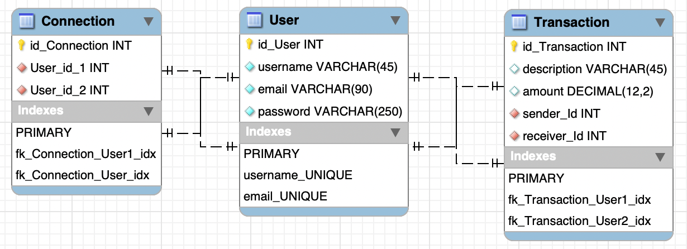

# PayMyBuddy
A simple prototype of a website to allow user to transfer money within eachother.
This app uses Java to run and stores the data in Mysql DB.

## Getting Started

These instructions will get you a copy of the project up and running on your local machine for development and testing purposes. See deployment for notes on how to deploy the project on a live system.

### Prerequisites

What things you need to install the software and how to install them

- Java 21
- Maven 
- Mysql 
- SpringBoot v 3.3.2

### Installing

A step by step series of examples that tell you how to get a development env running:

1.Install Java:

https://docs.oracle.com/javase/8/docs/technotes/guides/install/install_overview.html

2.Install Maven:

https://maven.apache.org/install.html

3.Install MySql:

https://dev.mysql.com/downloads/mysql/

After downloading the mysql 8 installer and installing it, you will be asked to configure the password for the default `root` account.
This code uses a special user account defined in the 'Data.sql` file under the `resources` folder. 

### Running App

Post installation of MySQL, Java and Maven, you will have to set up the tables and data in the data base.
For this, please run the sql commands present in the `Data.sql` file under the `resources` folder in the code base.

Finally, you will be ready to import the code into an IDE of your choice and run the App.java to launch the application.

### Testing App

In order tu run the tests, the DB has to be initialised with file `Datatest.sql` file under the `resources` folder from the tests.

### MPD

The following MPD is configured in the BDD thanks to the `Data.sql` file: 

